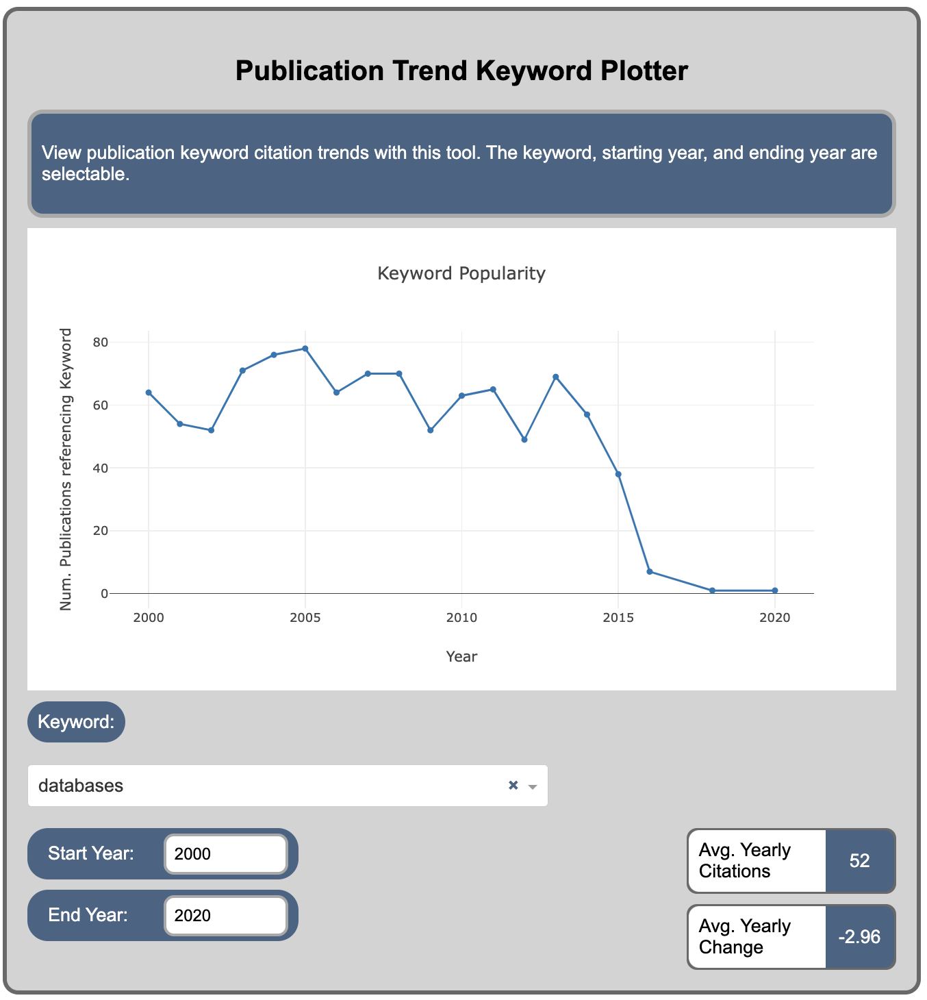
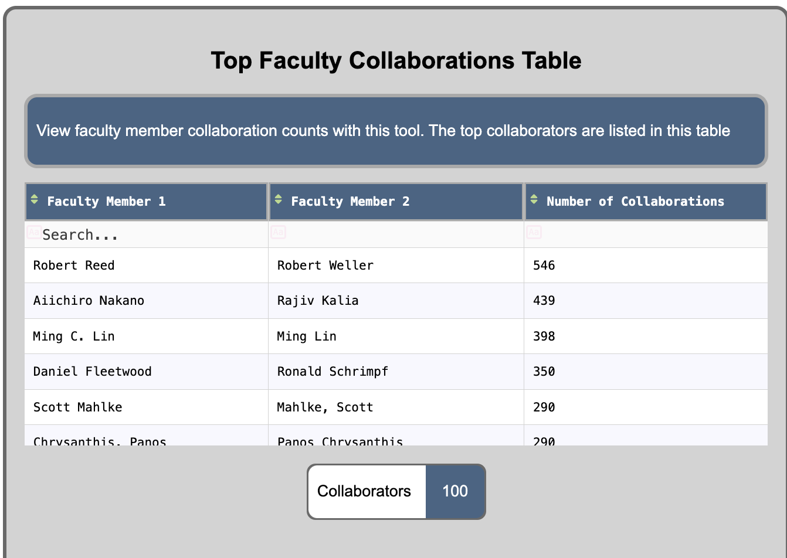
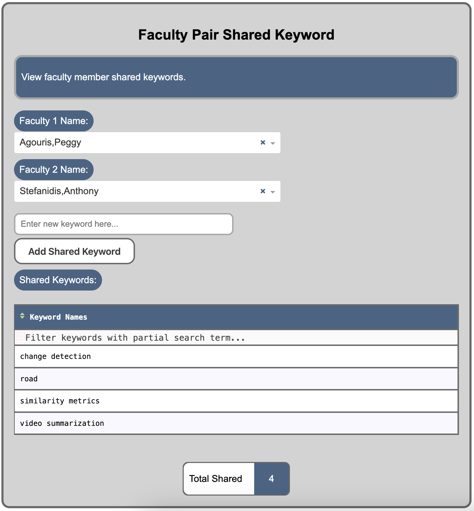
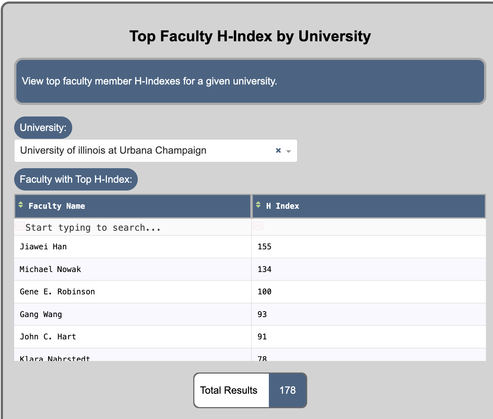
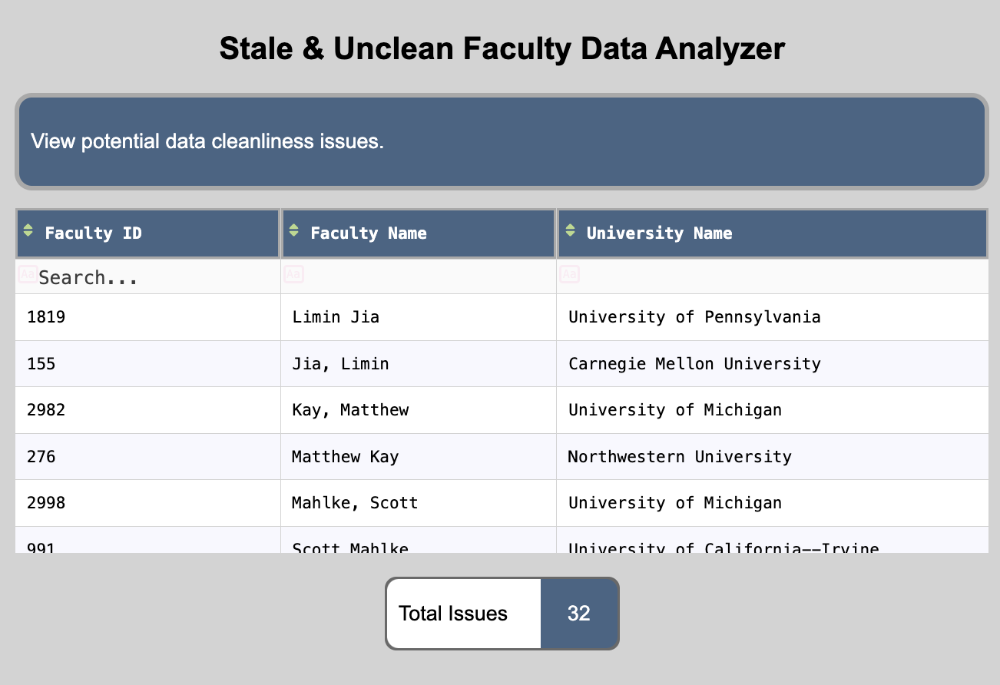

# CS411 Sp. 2024 Dashboard Project: Virtual Administrative Assistant

Group:  
Mark Kraman (mkraman2)  
George Vojvodic (dvojvo2)   
---

---

## Table of Contents

1. [Purpose](#purpose)
2. [Demo](#demo)
3. [Installation](#installation)
4. [Usage](#usage)
5. [Design](#design)
6. [Implementation](#implementation)
7. [Database-Techniques](#database_techniques)
8. [Extra-Credit Capabilities](#extra_credit_capabilities)
9. [Contributions](#contributions)

---

## Purpose

This dashboard, "Virtual Administrative Assistant", is intended for use by academic administrators and funding agencies to keep track of the contact information of top researchers, view research trends, and find researchers who are effective collaborators. To this end, widgets have been developed with features assisting in answering common questions such users may have. 

---

## Demo
The demo video is divided into multiple parts covering a summary and each widget independently.

[Link to Demo Video on Mediaspace](https://mediaspace.illinois.edu/media/t/1_bnm2y4cp)   
---

## Installation

Installation and usage may vary depending on the platform used. The following instruction set assumes the user is working on WSL2 Ubuntu-20.04 on Windows to launch the program, host MySQL, and host MongoDB. Neo4j is running on Windows and connects to the program running in WSL via the WSL nameserver configuration described in this section.

Prerequisites:
- MySQL must be installed (Linux) according to the CS411 course instructions.
    - HOST: localhost
    - USER: root
    - PASSWORD: test_root
    - DATABASE: academicworld
    - PORT: 3306
- MongoDB must be installed (Linux) according to the CS411 course instructions.
    - HOST: localhost
    - DATABASE: academicworld
    - PORT: 27017
- Neo4j must be installed (Windows) according to the CS411 course instructions.
    - USER: neo4j
    - PASSWORD: test_root
    - Add (or un-comment) the following lines of the neo4j.conf file:   
        ``` 
        server.default_listen_address=0.0.0.0   
        server.default_advertised_address=<ip>     
        ```
        where =&lt;ip&gt; where ip is the nameserver used by WSL, eg. which is found by running:
        ```
        cat /etc/resolv.conf
        ```
    - URI: bolt:/&lt;ip&gt;:7687
    - The configuration file ```neo4j_utils.py``` must also be updated with &lt;ip&gt;

- Python3 and pip package manager must be installed. 

```bash
# Install Dash library
$ pip install dash
# Install Numpy Library
$ pip install numpy
# Install Pandas library
$ pip install pandas
# Install requests library
$ pip install request
# Install PyMySQL library
$ pip install pymysql
# Install PyMongo library
$ pip install PyMongo
# Install Neo4j Python driver
$ pip install neo4j
```

---

## Usage

To start the Dashboard on the localhost, follow the below instructions:

1. Start the MySQL service and MongoDB process
    ```bash
    $ sudo service mysql start
    $ mongod &
    ```
2. After configuring Neo4j's network driver as described in the Installation section, start the Neo4j desktop application and start the "CS411 DBMS" database
3. Start the web app my running the line:
    ```bash
    $ python3 app.py
    ```
---

## Design

A Python helper function was written to simplify querying each of MySQL, MongoDB, and Neo4j using their respective Python libraries and drivers. MySQL and Neo4j respectively run queries, however, MongoDB's client's unique API is addressed here by making all queries using aggregation pipelines, which are flexible enough to address all required functions for the purpose of this dashboard. Below are descriptions of each widget implemented.   

### Widget 1: Publication Trend Keyword Plotter 
This widget plots the number of publications corresponding to a given keyword over a given date range, with these inputs provided by the user. The widget uses a stored procedure to retrieve the columns to plot which are converted to a Pandas DataFrame and plotted with Matplotlib. The stored procedure is shown in the Implementation section. In addition, it also shows the yearly average number of citations for any given keyword and how the keyword is trending on average for a given start and end year. In the provided preview, the keyword 'database' is on average receiving 3 less citations yearly between 2000 and 2020.




### Widget 2: Faculty Contact Information Updater
This widget displays faculty images and allows the user to adjust their contact information. This widget takes user input and may modify the academicworld MongoDB database in the backend with the relevant contact information.

The list of faculty members is retrieved from MongoDB with:
```mongodb
MongoClient(host, port)[db]["faculty"].aggregate([{"$project": { "_id": 0, "name": 1}}])
```

and updates are made by:
```mongodb
MongoClient(host, port)[db]["faculty"].aggregate([{"$match": {"name": <Faculty Name>}}])
MongoClient(host, port)[db]["faculty"].update_one({"name": <Faculty Name>}, {"$set": {"phone": <Faculty Phone>, "email": <Faculty Email>}})

```


### Widget 3: Top Faculty Collaborations Table
This widget displays top collaborators and the number of those collaborations using a Neo4j query shown below. Due to data cleanliness issues persisting in the academicworld database, some entries appear to include multiple entries of the same faculty member under different aliases. This issue is explored in widget six. The top 100 collaboration pairs are tabled.

```cypher
MATCH (f1:FACULTY)-[:PUBLISH]->(publication:PUBLICATION)<-[:PUBLISH]-(f2:FACULTY) \
WHERE f1 <> f2 AND f1.name < f2.name \
RETURN f1.name AS faculty1, f2.name AS faculty2, COUNT(publication) AS collaboration_count \
ORDER BY collaboration_count DESC \
LIMIT 100"
```



### Widget 4: Faculty Pair Shared Keyword Search
This widget shows shared keywords between faculty pairs. It allows the user to insert new keywords associated with a faculty member and leverages a stored procedure to standardize the query format for the displayed data. It also uses a transaction to ensure that when a keyword is updated for one faculty, it must be updated for an associated faculty. The transaction and stored procedure code is shown in the Database Techniques section, respectively.



### Widget 5: Top Faculty H-Index by University
This widget shows the H-Index for all faculty at a given university sorted descending by their H-Index. The calculation is performed from a view created according to a dropdown menu selection to get the university name:

```mysql
SELECT faculty_name, MAX(h_index) AS h_index
FROM (
SELECT faculty_name,
CASE WHEN ROW_NUMBER() OVER (PARTITION BY faculty_name ORDER BY num_citations DESC) <= num_citations THEN ROW_NUMBER() OVER (PARTITION BY faculty_name ORDER BY num_citations DESC) ELSE 0 END AS h_index
FROM faculty_publication_view
) AS subquery
GROUP BY faculty_name;
```

[H-Index Calculation Method Credit](https://xyquadrat.ch/blog/hindex-in-sql/)



### Widget 6: Stale & Unclean Faculty Data Analyzer
The integrity of data is critical to its usefulness for accurate judgements, and the given academicworld dataset has various issues with data cleanliness due to faculty name and university name formatting. This widget tables entries in the academicworld database that may be duplicates, after filtering for title case, the presence of honorific titles (Dr., Ph.D., etc.), and middle initials. It performs the analysis in Python, then runs an SQL query to collect and display the faculty members with potential duplicate information existing in the database.



---

## Implementation

A six widget dashboard is presented with a Dash frontend interacting with MySQL, MongoDB, and Neo4j databases in the backend. 

1. MySQL Connection     
MySQL is used in widgets 1, 4, 5, 6.

2. MongoDB Connection   
MongoDB is used in widget 2.

3. Neo4j    
Neo4j is used in widget 3. 

---

## Database Techniques

### Stored Procedures   
Widget 1 employs stored procedures with the below definition, of ```GetKeywordCitations``` to run queries on the database, collecting citation counts corresponding to keywords over a given year range.

```mysql
CREATE PROCEDURE GetKeywordCitations(IN kwd VARCHAR(255), IN year_start INT, IN year_end INT) BEGIN 
                         SELECT publication.year, COUNT(*) as keyword_count 
                         FROM keyword   
                         INNER JOIN publication_keyword ON keyword.id=publication_keyword.keyword_id    
                         INNER JOIN publication ON publication.id=publication_keyword.publication_id    
                         WHERE (keyword.name = kwd) AND (publication.year >= year_start) AND (publication.year <= year_end) 
                         GROUP BY publication.year  
                         ORDER BY publication.year ASC; 
                         END;   
```

Widget 4 employs a stored procedure to simplify repeated queries following the same pattern, shown below: 

```mysql
CREATE PROCEDURE GetFacultyPairKeywords(IN faculty_name_1 VARCHAR(255), IN faculty_name_2 VARCHAR(255)) BEGIN \
                        SELECT 
                        t1.faculty_id, 
                        f1.name, 
                        t2.faculty_id, 
                        f2.name, 
                        GROUP_CONCAT(DISTINCT keyword.name ORDER BY keyword.name SEPARATOR ', ') AS shared_keyword_names, 
                        COUNT(DISTINCT t1.keyword_id) AS shared_keywords_count 
                        FROM faculty_keyword t1 
                        INNER JOIN faculty_keyword t2 ON t1.keyword_id = t2.keyword_id 
                        INNER JOIN keyword ON t1.keyword_id = keyword.id 
                        INNER JOIN faculty as f1 ON t1.faculty_id = f1.id 
                        INNER JOIN  faculty as f2 ON t2.faculty_id = f2.id 
                        WHERE f1.id > f2.id AND (f1.name=faculty_name_1 OR f2.name=faculty_name_1) 
                        AND (f1.name=faculty_name_2 or f2.name=faculty_name_2) 
                        GROUP BY t1.faculty_id, t2.faculty_id 
                        LIMIT 1; 
                        END;"
```
### Transactions

Widget 4 implements the following transaction to ensure that keywords added to one faculty member are also added to the other:

```mysql
BEGIN;
INSERT INTO faculty_keyword (faculty_id, keyword_id, score) VALUES ({faculty_1_id}, {keyword_id}, 0); 
INSERT INTO faculty_keyword (faculty_id, keyword_id, score) VALUES ({faculty_2_id}, {keyword_id}, 0);
COMMIT;
```

### Views
Widget 5 implements views to create virtual tables which are conveniently operated on to calculate H-Indexes for faculty members. 

```mysql
DROP VIEW If EXISTS faculty_publication_view;
CREATE VIEW faculty_publication_view AS
SELECT faculty.id as faculty_id, faculty.name as faculty_name, publication.id as publication_id, publication.num_citations, university.name as university_name
FROM faculty 
JOIN faculty_publication on faculty.id = faculty_publication.faculty_id
JOIN publication on publication.id = faculty_publication.publication_id
JOIN university on university.id = faculty.university_id;
```
---
